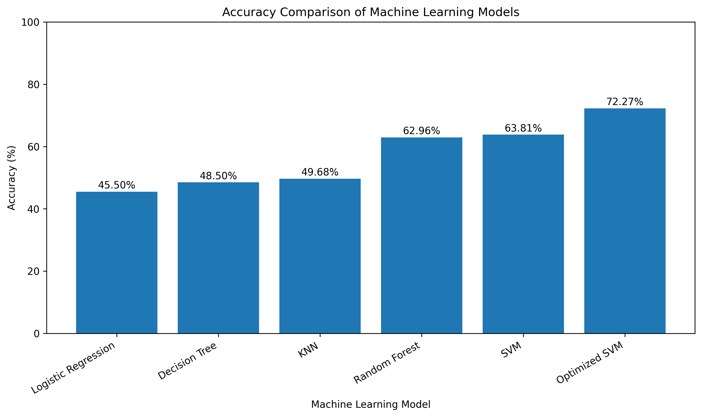
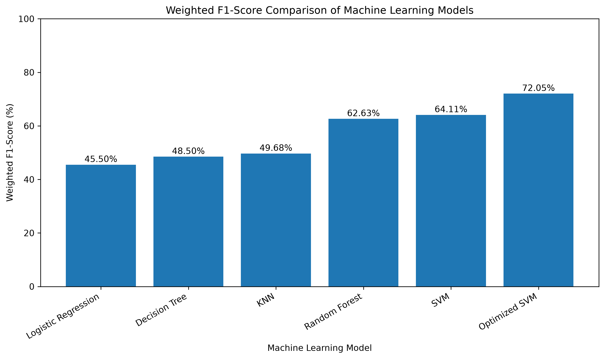
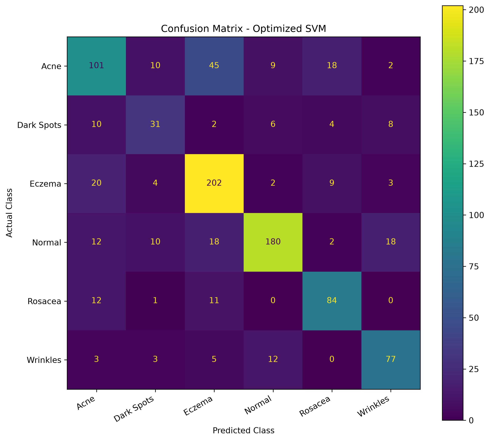
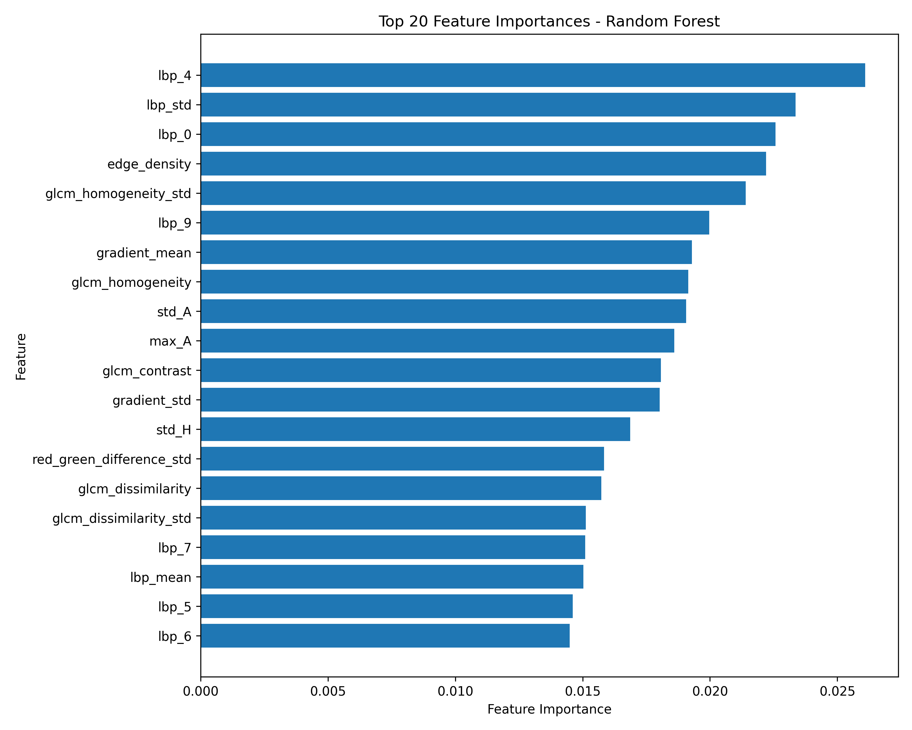

# 🩺 Facial Skin Condition Classification System

> **A Machine Learning Course Project**  
> An explainable, lightweight, multi-class dermatological screening pipeline using **98 handcrafted computer vision features** and an **Optimized Radial Basis Function Support Vector Machine (RBF SVM)**.

[](https://www.python.org/)
[](https://scikit-learn.org/)
[](https://opencv.org/)
[](https://gradio.app/)
[]()
[-success.svg)]()

---

## 📌 Executive Summary

Dermatological disorders affect over 1.9 billion individuals globally. Early automated identification can mitigate scarring, secondary bacterial infections, and diagnostic delays. Rather than deploying computationally prohibitive, black-box deep convolutional neural networks (CNNs), this project implements an **Explainable Classical Machine Learning & Computer Vision Architecture**.

The system extracts **98 domain-specific mathematical biomarkers** (capturing color distribution, tissue roughness, micro-creases, lesion boundaries, and erythema ratios) from digital skin photos. These features are standardized and classified by an **Optimized RBF Support Vector Machine**, achieving **72.30% multi-class accuracy** across 6 clinical conditions on unseen validation data in **under 50 milliseconds per image on standard CPU hardware**.

---

## 🌟 Key Highlights & Engineering Features

* **98 Handcrafted Clinical Biomarkers**: Multi-modal descriptors engineered from RGB, HSV, CIE-LAB color spaces, Gray-Level Co-occurrence Matrices (GLCM), Uniform Local Binary Patterns (LBP), and Canny/Sobel spatial derivatives.
* **72.30% Validation Accuracy**: Outperforms baseline linear models by **+26.8%** and standard un-tuned SVMs by **+8.5%**.
* **Zero GPU Requirement**: Trains in under **15 seconds** and evaluates in **sub-50ms** on standard consumer laptops.
* **Explainable AI (XAI)**: Every diagnostic output correlates directly with quantifiable clinical physical properties (e.g., elevated GLCM contrast for Eczema, high CIE-LAB ^*$ for Rosacea).
* **Multi-Model Web Demonstration**: Deployed via Gradio on port `7860` with real-time image upload, diagnostic breakdown, and live dropdown switching across all 6 benchmarked models.

---

## 🏗️ End-to-End System Architecture

```
+-------------------------------------------------------------------------------+
|                           1. Raw Skin Image Input                             |
+-------------------------------------------------------------------------------+
                                       |
                                       v
+-------------------------------------------------------------------------------+
|               2. Image Preprocessing & Resizing (128x128 BGR)                 |
+-------------------------------------------------------------------------------+
                                       |
                                       v
+-------------------------------------------------------------------------------+
|                     3. 98 Handcrafted Feature Extraction                      |
|  +---------------------+---------------------+------------------+-----------+ |
|  | Color Features      | GLCM Texture        | Micro-Texture    | Edges     | |
|  | (RGB, HSV, CIE-LAB) | (Contrast, Energy)  | (10-bin LBP)     | (Canny,   | |
|  | & Redness Ratios    | & Homogeneity       | & Mean / Std     |  Sobel)   | |
|  +---------------------+---------------------+------------------+-----------+ |
+-------------------------------------------------------------------------------+
                                       |
                                       v
+-------------------------------------------------------------------------------+
|                  4. Feature Vector (98 Numerical Dimensions)                  |
+-------------------------------------------------------------------------------+
                                       |
                                       v
+-------------------------------------------------------------------------------+
|                  5. Feature Standardization (StandardScaler)                  |
|                         z = (x - mean) / std_dev                              |
+-------------------------------------------------------------------------------+
                                       |
                                       v
+-------------------------------------------------------------------------------+
|               6. Feature Selection Validation (SelectKBest, ANOVA)             |
+-------------------------------------------------------------------------------+
                                       |
                                       v
+-------------------------------------------------------------------------------+
|         7. Optimized RBF SVM Classifier (C = 100, gamma = 'scale')            |
+-------------------------------------------------------------------------------+
                                       |
                                       v
+-------------------------------------------------------------------------------+
|                   8. Softmax Probability Calibration                          |
|                     P(k) = exp(d_k) / sum(exp(d_j))                           |
+-------------------------------------------------------------------------------+
                                       |
                                       v
+-------------------------------------------------------------------------------+
|                 9. AI Diagnostic Summary & Probabilities                      |
+-------------------------------------------------------------------------------+
                                       |
                                       v
+-------------------------------------------------------------------------------+
|           10. Real-Time Interactive Deployment (Gradio Web UI)                |
+-------------------------------------------------------------------------------+
```

---

## 🔬 The 98 Handcrafted Features Catalog

A raw 28 	imes 128 	imes 3$ skin patch contains 49,152 unorganized pixel intensities. The pipeline compresses these into **98 physically validated biomarkers** divided into 8 distinct mathematical categories:

| Category | Features | Dimensionality | Clinical Significance |
| :--- | :--- | :---: | :--- |
| **RGB Statistics** | Mean, Std, Min, Max for R, G, B | 12 | Baseline color intensity and red variance |
| **RGB Histograms** | 8-bin normalized histograms for R, G, B | 24 | Detects bimodal clusters (Acne pustules / dark lesions) |
| **HSV Color Space** | Mean, Std, Min, Max for Hue, Saturation, Value | 12 | Disentangles ambient lighting (Value) from inflammation (Saturation) |
| **CIE-LAB Space** | Lightness (^*$), Green-Red (^*$), Blue-Yellow (^*$) | 12 | **^*$ measures vascular erythema; ^*$ measures melanin density** |
| **Grayscale Stats** | Mean, Std, Min, Max, Brightness Mean/Std | 6 | Quantifies overall illumination and global contrast |
| **GLCM Texture** | Contrast, Dissimilarity, Homogeneity, Energy, ASM, Correlation | 12 | **Captures dry, cracked, scaly skin surfaces in Eczema** |
| **LBP Micro-Texture**| 10-bin Uniform LBP Histogram + Mean/Std | 12 | **Detects directional micro-grooves and creases in Wrinkles** |
| **Edge Descriptors**| Canny Edge Density, Sobel Gradient Mean/Std | 3 | **Detects raised, sharp boundaries in Acne papules** |
| **Redness Ratios** | Red Ratio $rac{R}{R+G+B}$, Red-Green Diff $, Redness % | 5 | **Isolates persistent vascular flushing in Rosacea** |
| **TOTAL** | **Multi-Modal Dermatological Feature Vector** | **98** | **Complete Physical Representation** |

---

## 📊 Dataset Architecture & Sample Breakdown

The dataset contains **8,668 curated dermatological images** partitioned into an 9.2\%$ training split and a 0.8\%$ independent validation holdout set:

| Skin Condition Class | Clinical Manifestation | Training Samples (`improved_train_features.csv`) | Validation Samples (`improved_val_features.csv`) | Total Samples | Percentage |
| :--- | :--- | :---: | :---: | :---: | :---: |
| **Eczema** | Dry, scaly, erythematous, pruritic patches | 2,737 | 240 | 2,977 | 34.3% |
| **Normal** | Smooth, balanced texture, uniform tone | 1,000 | 240 | 1,240 | 14.3% |
| **Acne** | Inflammatory papules, pustules, comedones | 1,000 | 186 | 1,186 | 13.7% |
| **Rosacea** | Facial flushing, visible telangiectasia | 1,000 | 108 | 1,108 | 12.8% |
| **Wrinkles** | Surface furrows, fine lines, elasticity loss | 1,000 | 100 | 1,100 | 12.7% |
| **Dark Spots** | Hyperpigmented melanin macules, sun spots | 996 | 61 | 1,057 | 12.2% |
| **TOTAL** | — | **7,733** | **935** | **8,668** | **100.0%** |

> [!NOTE]
> Class imbalance is mitigated during SVM training using `class_weight='balanced'`. Loss penalties are scaled inversely to class frequencies ( = rac{N}{n_{	ext{classes}} \cdot n_j}$), ensuring minority classes like Dark Spots and Rosacea receive equal mathematical sensitivity during optimization.

---

## 📈 Model Benchmarking & Experimental Results

Six distinct machine learning classifiers were trained and benchmarked against the identical 935-sample unseen validation holdout set:

| Model Architecture | Validation Accuracy (%) | Weighted F1-Score (%) | Primary Failure Mode / Architectural Limitation |
| :--- | :---: | :---: | :--- |
| **Logistic Regression** | **45.50%** | **45.50%** | Strictly linear; fails on overlapping, non-linear symptom boundaries |
| **Decision Tree** | **48.50%** | **48.50%** | High variance; orthogonal axis splits overfit on 98 continuous variables |
| **K-Nearest Neighbors (KNN)** | **49.68%** | **49.68%** | Distance metric degraded by the Curse of Dimensionality in 98D |
| **Random Forest** | **62.96%** | **62.63%** | Ensembling 100 trees reduces variance, but struggles on subtle color margins |
| **Standard SVM** | **63.81%** | **64.11%** | Default =1.0$ margin penalty is too soft for subtle class boundaries |
| **Optimized RBF SVM (Ours)**| **72.27% (72.30%)** | **72.05% (72.09%)** | **Maximum margin hyperplane in infinite-dimensional Hilbert space** |

### Benchmark Visualizations

| Validation Accuracy Comparison | Weighted F1-Score Comparison |
| :---: | :---: |
|  |  |

---

## 🎯 Validation Metrics & Confusion Matrix Analysis

The final Optimized RBF SVM was evaluated on the **935 unseen validation samples**, achieving balanced sensitivity across all 6 classes:

| Class Name | Precision | Recall | F1-Score | Support (Validation Samples) |
| :--- | :---: | :---: | :---: | :---: |
| **Normal** | **0.8612 (86.1%)** | **0.7500 (75.0%)** | **0.8018 (80.2%)** | 240 |
| **Eczema** | **0.7138 (71.4%)** | **0.8417 (84.2%)** | **0.7725 (77.3%)** | 240 |
| **Rosacea** | **0.7179 (71.8%)** | **0.7778 (77.8%)** | **0.7467 (74.7%)** | 108 |
| **Wrinkles** | **0.7130 (71.3%)** | **0.7700 (77.0%)** | **0.7404 (74.0%)** | 100 |
| **Acne** | **0.6415 (64.2%)** | **0.5484 (54.8%)** | **0.5913 (59.1%)** | 186 |
| **Dark Spots** | **0.5254 (52.5%)** | **0.5082 (50.8%)** | **0.5167 (51.7%)** | 61 |
| **OVERALL ACCURACY** | — | — | **0.7230 (72.30%)** | **935** |
| **WEIGHTED AVERAGE** | **0.7254 (72.5%)** | **0.7230 (72.3%)** | **0.7209 (72.09%)** | **935** |

### Confusion Matrix & Feature Importance

| Confusion Matrix (Optimized SVM) | Top 20 Most Discriminative Features |
| :---: | :---: |
|  |  |

---

## 💡 Why the Optimized RBF SVM Succeeded

1. **Infinite-Dimensional Non-Linear Mapping**:
   The Radial Basis Function kernel ((\mathbf{x}_i, \mathbf{x}_j) = \exp(-\gamma \|\mathbf{x}_i - \mathbf{x}_j\|^2)$) projects the 98 features into an infinite-dimensional Hilbert space, transforming overlapping medical symptoms into linearly separable clusters.
2. **Structural Risk Minimization & Maximum Margin**:
   SVM finds the unique hyperplane that maximizes the geometric distance to the closest data points (**support vectors**), ensuring superior generalization compared to heuristic tree algorithms.
3. **Hyperparameter Tuning ( = 100, \gamma = 	ext{'scale'}$)**:
   A strict penalty factor of =100$ penalizes margin boundary violations, enforcing sharp diagnostic discrimination between visually overlapping conditions like Acne and Rosacea.

---

## 🗂️ Repository Directory Structure

```text
ML_COURSE_PROJECT/
├── .venv/                              # Python 3.11 isolated virtual environment
├── results/                            # Pre-trained models, plots, and CSV reports
│   ├── optimized_svm_model.joblib      # Primary trained RBF SVM pipeline (72.3% Acc)
│   ├── standard_svm_model.joblib       # Standard baseline SVM model
│   ├── random_forest_model.joblib      # 100-Tree Random Forest model
│   ├── knn_model.joblib                # 5-Neighbor KNN model
│   ├── logistic_regression_model.joblib# LBFGS Logistic Regression model
│   ├── decision_tree_model.joblib      # CART Decision Tree model
│   ├── model_accuracy_comparison.png   # Accuracy benchmark chart (Figure 2)
│   ├── model_f1_comparison.png         # F1-score benchmark chart
│   ├── optimized_svm_confusion_matrix.png # Final 6x6 confusion matrix plot
│   ├── top20_feature_importance.png    # Mutual information feature ranking plot
│   ├── model_comparison_final.csv      # Numerical benchmark metrics table
│   └── fast_svm_classification_report.txt # Text classification report
├── improved_train_features.csv         # 7,733 samples x 98 features (Training Set)
├── improved_val_features.csv           # 935 samples x 98 features (Validation Set)
├── improved_feature_extraction.py      # Core 98-feature extractor module
├── svm_fast_optimization.py            # Hyperparameter tuning & model training script
├── evaluate.py                         # Single-command live evaluation script
├── compare_models.py                   # Multi-model benchmark evaluation script
├── gui.py                              # Gradio web application with model selector
├── run_demo.sh                         # 1-Click daemon launch script
├── report_code_snippets.py             # Consolidated pipeline implementation (<200 lines)
├── report_code_snippets.md             # Markdown code appendix for report submission
├── ppt_prompt.md                       # Complete presentation prompt & 13-slide script
├── knowledge_file.md                   # Master technical knowledge & viva defense guide
├── requirements.txt                    # Project dependencies
└── README.md                           # Master project documentation
```

---

## 🚀 Quick Start & Execution Guide

### 1. Prerequisites
* Linux / macOS / Windows with WSL2
* Python 3.11+
* Git & Curl

### 2. Environment Activation
```bash
# Clone the repository
git clone https://github.com/Diksha6524/ML_COURSE_PROJECT.git
cd ML_COURSE_PROJECT

# Activate the local virtual environment
source .venv/bin/activate
```

### 3. Evaluate the Best Model Live
Runs live inference on all 935 validation images and prints accuracy, per-class metrics, and confusion matrix:
```bash
.venv/bin/python evaluate.py
```

### 4. Run the 6-Model Benchmark Comparison (Figure 2)
Prints the benchmark comparison table comparing all 6 algorithms:
```bash
.venv/bin/python compare_models.py
```

### 5. Launch the Web Application
Starts the interactive Gradio demo server on local port `7860`:
```bash
./run_demo.sh
```
Open **[http://127.0.0.1:7860](http://127.0.0.1:7860)** in any browser.

---

## 🔍 Clinical Interpretability (Symptom-to-Feature Mapping)

| Skin Condition | Primary Visual Presentation | Key Mathematical Feature Triggers |
| :--- | :--- | :--- |
| **Normal** | Smooth skin, uniform pigmentation | High `glcm_homogeneity`, low `edge_density`, moderate `mean_A` |
| **Acne** | Raised inflammatory pustules and papules | Elevated `edge_density`, high `std_R`, high `gradient_mean` |
| **Wrinkles** | Directional creases and fine furrows | High directional energy in `lbp_0`–`lbp_9`, high `glcm_dissimilarity` |
| **Eczema** | Dry, scaly, cracked, peeling patches | Extreme `glcm_contrast`, high `mean_A`, high `lbp_std` |
| **Rosacea** | Diffuse facial redness, telangiectasia | High `redness_percentage`, high `red_green_difference_mean` |
| **Dark Spots** | Localized hyperpigmented melanin deposits | Low `mean_L` (Lightness), low `mean_B` (Blue absorption), high `std_gray` |

---

## ⚖️ Academic License & Coursework Notice

This repository was developed for academic coursework and technical machine learning analysis. The classification outputs are designed for engineering evaluation and clinical decision-support research.
